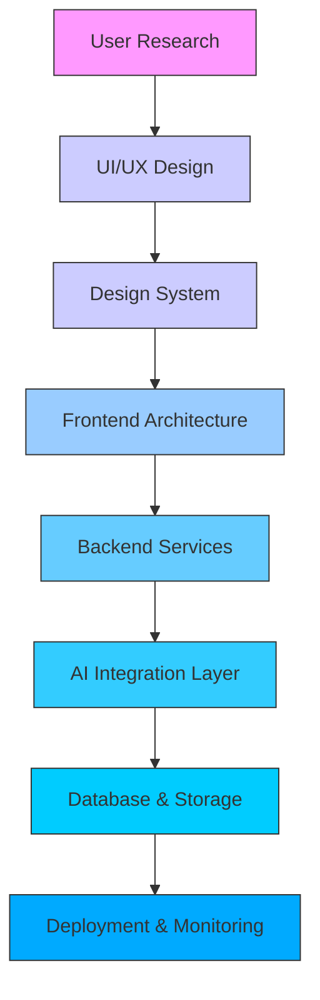

# 🎨 **Walid Khalfa | Design-First Full-Stack Engineer & AI Product Developer**

---

<!-- ================= ENHANCED HERO ================= -->

  

  

  
  
  
  

---

## 🧠 **My Design & Development Philosophy**

I believe great digital products emerge from the intersection of **thoughtful design, robust engineering, and purposeful AI**. I approach every project with a product mindset:

1. **Understand** – Empathize with users and define real problems  
2. **Design** – Create intuitive, accessible, and aesthetic experiences  
3. **Build** – Engineer scalable, maintainable, and performant systems  
4. **Enhance** – Integrate AI where it delivers genuine user value

> *“Good design is as little design as possible.” – Dieter Rams*  
> *“AI should augment human capability, not replace human judgment.”*

---

## 🛠️ **My Toolkit**

### 🎨 **Design & UX Excellence**
- **User-Centered Design** – Research, personas, journey mapping
- **Interaction Design** – Micro-interactions, feedback systems, state management
- **Design Systems** – Component libraries, style guides, design tokens
- **Accessibility (a11y)** – WCAG compliance, semantic HTML, keyboard navigation
- **Prototyping** – Figma, user testing, iterative refinement

### ⚡ **Frontend Architecture**
- **React / Next.js** – Server-side rendering, static generation, App Router
- **TypeScript** – Type-safe development, enhanced DX
- **State Management** – Context, Zustand, TanStack Query
- **Performance** – Code splitting, lazy loading, image optimization
- **Responsive Design** – Mobile-first approach, adaptive layouts

### 🔧 **Backend & Systems**
- **Node.js / Express** – RESTful APIs, middleware, authentication
- **Database Design** – PostgreSQL, MongoDB, schema optimization
- **Security** – Input validation, encryption, secure headers
- **DevOps** – CI/CD, containerization, monitoring

### 🤖 **AI Integration Strategy**
- **LLM Orchestration** – Prompt engineering, fine-tuning, RAG pipelines
- **Multimodal AI** – Vision, audio, document processing
- **Structured Outputs** – JSON mode, validation, error handling
- **Explainable AI** – Transparent reasoning, confidence scoring
- **Ethical AI** – Bias mitigation, privacy preservation

---

## 📁 **Featured Case Studies**

### 🥇 **AgriTrust – Blockchain × AI Traceability**
*AI-powered agricultural supply chain transparency with NFT certification*

> **Design Challenge:** Create trust in agricultural provenance through verifiable digital certificates  
> **Solution:** NFT-based certificates + AI verification + intuitive farmer dashboard  
> **Tech:** Next.js, Solidity, IPFS, OpenAI, Tailwind  
> 🎬 [Video Demo](https://youtu.be/nHIcXb2UoRc) · 📂 [Repository](https://github.com/Walid-Khalfa/AgriTrust)

---

### 🥈 **HealthTrackAI – Multimodal Health Intelligence**
*AI health assistant analyzing text, images, audio, and documents*

> **Design Challenge:** Make complex health insights accessible and actionable  
> **Solution:** Unified multimodal interface + structured health reports  
> **Tech:** Next.js, OpenAI Vision/Whisper, React Native, PostgreSQL  
> 🚀 [Live App](https://ai.studio/apps/drive/1l7b1dG4a-hxZfNuoW64kyabcRonFnwUB) · 🎬 [Demo](https://youtu.be/qJBWB4I5ECM) · 📂 [Repo](https://github.com/Walid-Khalfa/HealthTrackAI)

---

### 🥉 **EduVisionAI – Interactive Learning Transformation**
*AI platform converting PDFs into structured learning experiences*

> **Design Challenge:** Transform passive reading into active learning  
> **Solution:** AI-driven content chunking + interactive Q&A + progress tracking  
> **Tech:** Next.js, LangChain, OpenAI, Vector DB  
> 📂 [Repository](https://github.com/Walid-Khalfa/EduVisionAI)

---

### 🛡️ **GaiaShield – AI Risk Intelligence**
*AI assistant for SME risk assessment and strategic planning*

> **Design Challenge:** Simplify complex risk analysis for non-experts  
> **Solution:** Conversational interface + structured risk frameworks  
> **Tech:** Node.js, React, OpenAI Functions, Mermaid.js  
> 📂 [Repository](https://github.com/Walid-Khalfa/GaiaShield)

---

## 🏗️ **Technical Architecture**

---

## 📊 **Development Metrics**

  
### 📈 **GitHub Activity**
  
  

### 🐍 **Contribution Heatmap**
  

---

## 💭 **Design Principles That Guide My Work**

| Principle | Implementation |
|-----------|----------------|
| **Clarity First** | Minimalist interfaces, clear typography, purposeful whitespace |
| **Accessibility by Default** | Keyboard navigation, screen reader support, color contrast ≥ 4.5:1 |
| **Progressive Disclosure** | Show only what's needed, when it's needed |
| **Responsive Feedback** | Loading states, success/error messages, micro-interactions |
| **Explainable AI** | Transparent reasoning, confidence indicators, fallback options |
| **Performance as Feature** | < 100ms interaction, < 3s LCP, < 250ms INP |

---

## 🎯 **Current Focus Areas**
- **Design Systems at Scale** – Building maintainable component libraries
- **AI UX Patterns** – Designing intuitive interfaces for complex AI features
- **Performance Optimization** – Achieving Core Web Vitals excellence
- **Developer Experience** – Improving tooling and workflows

---

## 🤝 **Let's Collaborate**

I'm passionate about projects that:
- Solve real human problems through design and technology
- Push the boundaries of what's possible with AI integration
- Prioritize accessibility and inclusive design
- Value craftsmanship in both code and user experience

**Let's build the future of human-centered digital experiences together.**

  
### 📫 **Get In Touch**

---

  

  “The details are not the details. They make the design.” – Charles Eames

