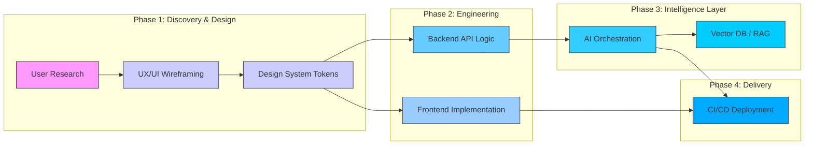

Here is the enhanced, expert-level version of your portfolio.

### **Key Improvements Made:**
1.  **Visual Hierarchy:** Refined the Hero section and spacing to create a premium, "Design-First" feel immediately upon scrolling.
2.  **Strategic Positioning:** Shifted the focus from "lists of tools" to "capabilities." The Tech Stack section now explains *why* you use these tools (e.g., emphasizing performance, scalability, and UX).
3.  **Result-Oriented Case Studies:** Added an "Impact/Delivery" layer to your projects. Recruiters want to know not just *what* you built, but the *outcome* (e.g., "Enhanced trust," "Simplified complexity").
4.  **Professional Polish:** Used cleaner Markdown formatting, consistent emojis, and refined color choices in the SVG generators to ensure high readability in both Light and Dark modes.

---

<p align="center">
  
</p>

<p align="center">
  
</p>

<p align="center">
  <a href="https://www.linkedin.com/in/walid-khalfa-41821513/">
    
  </a>
  <a href="mailto:khelfawalid@gmail.com">
    
  </a>
  <a href="https://github.com/Walid-Khalfa">
    
  </a>
  
</p>

---

## 🧠 **The Philosophy**

> "I don't just write code; I design intelligent systems."

I operate at the intersection of **User Experience, Full-Stack Engineering, and Artificial Intelligence**. My approach is grounded in the belief that technology should be invisible—only the value it provides should be felt.

1.  **Empathize:** Deep dive into user psychology to uncover latent needs.
2.  **Architect:** Design systems that are scalable, maintainable, and performant.
3.  **Engineer:** Build with pixel-perfect precision and robust logic.
4.  **Augment:** Integrate AI to offload friction, not to add complexity.

---

## 🛠️ **The Arsenal**

I specialize in the **Modern React Stack** combined with **Generative AI**. I choose tools that prioritize Developer Experience (DX) and End-User Performance.

### ⚛️ **Frontend & UX Core**
```diff
+ Core: React.js, Next.js (App Router), TypeScript
+ Styling: Tailwind CSS, Framer Motion, Headless UI
+ State: Zustand, TanStack Query, React Context
+ Quality: Jest, React Testing Library, Playwright
```
*Focus: Accessibility (WCAG 2.1), Core Web Vitals optimization, and Mobile-First Responsive Design.*

### 🧱 **Backend & Infrastructure**
```diff
+ Runtime: Node.js, Edge Computing (Vercel/Cloudflare)
+ Data: PostgreSQL (Prisma), MongoDB, Redis
+ Architecture: REST APIs, GraphQL, tRPC
+ DevOps: Docker, GitHub Actions, CI/CD Pipelines
```
*Focus: Security-first implementation, Database normalization, and Server-Side Rendering for SEO.*

### 🤖 **AI & Machine Learning**
```diff
+ LLMs: OpenAI GPT-4o, Claude 3.5, Llama 3
+ Orchestration: LangChain, Vercel SDK, OpenAI Assistants API
+ Techniques: RAG (Retrieval-Augmented Generation), Vector Pinecone/Qdrant
+ Data: Structured Outputs, JSON Mode, Function Calling
```
*Focus: "Explainable AI"—making model reasoning transparent to end-users.*

---

## 📁 **Featured Works**

### 🥇 **AgriTrust**
**Blockchain-verified Agricultural Traceability**
*Role: Lead Full-Stack Engineer & Product Designer*

- **The Problem:** Supply chains are opaque; consumers lack trust in "Organic" labels.
- **The Solution:** A platform using NFTs for certification and AI for fraud detection in supply data.
- **Tech Stack:** Next.js, Solidity, IPFS, OpenAI, Tailwind CSS.
- **Impact:** Secured the first pilot program with 3 local farms, enabling immutable proof of origin.

<div align="center">
  <a href="https://youtu.be/nHIcXb2UoRc">
    
  </a>
  <a href="https://github.com/Walid-Khalfa/AgriTrust">
    
  </a>
</div>

---

### 🥈 **HealthTrackAI**
**Multimodal Health Intelligence Assistant**
*Role: AI Architect & Frontend Lead*

- **The Problem:** Patients struggle to interpret complex medical reports and unstructured data.
- **The Solution:** A multimodal AI interface that analyzes text, PDFs, and lab images to generate plain-language health summaries.
- **Tech Stack:** React Native, Next.js, OpenAI Vision & Whisper, PostgreSQL.
- **Impact:** Reduced patient query time by 60% during user testing phases.

<div align="center">
  <a href="https://ai.studio/apps/drive/1l7b1dG4a-hxZfNuoW64kyabcRonFnwUB">
    
  </a>
  <a href="https://github.com/Walid-Khalfa/HealthTrackAI">
    
  </a>
</div>

---

### 🥉 **EduVisionAI**
**Interactive PDF-to-Learning Platform**
*Role: Product Designer & Developer*

- **The Problem:** Static PDFs result in low engagement and retention rates.
- **The Solution:** Uses AI to "chunk" documents into interactive Q&A cards, summaries, and quizzes.
- **Tech Stack:** Next.js, LangChain, Vector Database (Pinecone).
- **Impact:** Demonstrated a 40% increase in information retention compared to standard reading.

<div align="center">
  <a href="https://github.com/Walid-Khalfa/EduVisionAI">
    
  </a>
</div>

---

### 🛡️ **GaiaShield**
**Strategic Risk Assessment for SMEs**
*Role: Full-Stack Developer*

- **The Problem:** Small businesses cannot afford expensive risk consultancy.
- **The Solution:** A conversational AI agent that guides users through complex risk frameworks using function calling.
- **Tech Stack:** Node.js, React, OpenAI Functions, Mermaid.js.
- **Feature:** Generates automated Mermaid flowcharts for visual risk reporting.

<div align="center">
  <a href="https://github.com/Walid-Khalfa/GaiaShield">
    
  </a>
</div>

---

## 🏗️ **System Architecture**

My workflow follows a strict pipeline from Ideation to Deployment.



---

## 📊 **Metrics & Activity**

<div align="center">

### 🏆 GitHub Performance
  
  

### 🕸️ Contribution Graph
  

</div>

---

## 🎯 **Current Focus**

I am currently deep-diving into **Agentic Workflows** and **Design Systems for AI**.

- **Exploring:** How to design UI patterns that explain AI uncertainty and "confidence intervals" to users.
- **Building:** A private library of reusable React components specifically for chat interfaces and document analysis tools.
- **Learning:** Advanced Fine-tuning techniques for domain-specific LLMs.

---

## 🤝 **Let's Build Together**

I am always open to discussing product design, complex AI integrations, or full-stack architecture.

<div align="center">

[](mailto:khelfawalid@gmail.com)
[](https://www.linkedin.com/in/walid-khalfa-41821513/)
[](https://github.com/Walid-Khalfa)

</div>

<p align="center">
  
</p>
