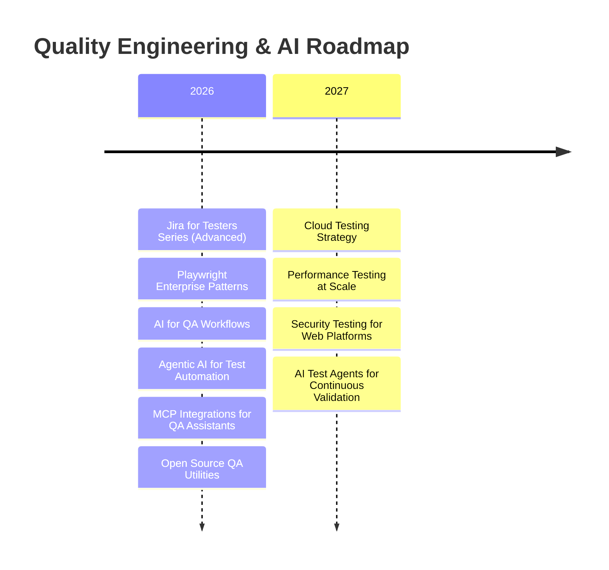

  

  

  
  
  

  
  
  
  
  
  

---

## About Me

I’m **Walid Khalfa**, a **Senior QA Engineer** and **Test Automation Engineer** focused on building reliable, scalable software quality systems.  
My work combines **Quality Engineering**, **Playwright automation**, and **AI-driven testing** to help teams ship faster with confidence.

- Designing robust end-to-end automation frameworks for modern web applications
- Integrating AI into testing workflows for smarter defect detection and faster feedback loops
- Training QA engineers and developers through practical, industry-ready ISTQB and automation content
- Advocating quality as a product mindset across development, testing, and delivery

---

## Current Focus

- Playwright architecture for enterprise-grade test automation
- AI Agents for software testing and quality workflows
- Model Context Protocol (MCP) integration patterns
- GitHub Copilot for QA productivity and shift-left quality
- OpenAI-powered testing assistants and test generation
- Quality Engineering practices for high-velocity teams
- CI/CD quality gates with measurable release confidence
- Agentic AI use cases in QA and developer workflows

---

## Tech Stack

### QA & Automation

  
  
  
  
  
  
  
  
  
  

### Programming

  
  
  
  
  

### Frontend

  
  
  

### Backend

  
  
  
  
  

### AI

  
  
  
  
  
  
  

---

## Featured Projects

### 1) KhalfaJobs
**Problem:** Job seekers struggle to find role-matched opportunities with actionable feedback.  
**Solution:** AI-powered job intelligence platform for matching, resume insights, and application optimization.  
**Tech Stack:** Next.js, TypeScript, PostgreSQL, Prisma, OpenAI  
**Key Features:** Smart matching, AI resume scoring, role-fit recommendations, recruiter-friendly dashboards  
**GitHub:** [KhalfaJobs](https://github.com/Walid-Khalfa/KhalfaJobs)  
**Demo:** [Live Demo](https://khalfajobs.com)

### 2) CaseMagic
**Problem:** Case preparation and legal research workflows are fragmented and time-consuming.  
**Solution:** Intelligent assistant for case summarization, document extraction, and knowledge retrieval.  
**Tech Stack:** React, Node.js, OpenAI, LangChain, Vector DB  
**Key Features:** AI summaries, semantic retrieval, document Q&A, context-aware responses  
**GitHub:** [CaseMagic](https://github.com/Walid-Khalfa/CaseMagic)  
**Demo:** [Live Demo](https://casemagic.app)

### 3) Playwright Framework
**Problem:** Teams need maintainable and scalable automation frameworks with clear reporting.  
**Solution:** Enterprise-ready Playwright framework with layered architecture and CI-first execution.  
**Tech Stack:** Playwright, TypeScript, GitHub Actions, Docker  
**Key Features:** Page Object Model, API + UI testing, parallel execution, reusable fixtures, rich reports  
**GitHub:** [Playwright Framework](https://github.com/Walid-Khalfa/playwright-framework)  
**Demo:** [Framework Walkthrough](https://www.youtube.com/)

### 4) ISTQB Resources
**Problem:** Many learners need concise, practical, exam-focused ISTQB guidance.  
**Solution:** Curated study resources, practice material, and structured learning paths for CTFL.  
**Tech Stack:** Markdown, GitHub Pages, Educational content workflows  
**Key Features:** Exam-aligned notes, quick revision guides, practical QA examples  
**GitHub:** [ISTQB Resources](https://github.com/Walid-Khalfa/istqb-resources)  
**Demo:** [Learning Hub](https://walid-khalfa.dev/istqb)

### 5) Jira for Testers
**Problem:** QA teams often underuse Jira and Xray for traceability and test management.  
**Solution:** Practical toolkit and tutorials for QA planning, execution, and reporting in Jira/Xray.  
**Tech Stack:** Jira, Xray, Test Management best practices, Automation integrations  
**Key Features:** Test lifecycle templates, traceability patterns, defect workflow optimization  
**GitHub:** [Jira for Testers](https://github.com/Walid-Khalfa/jira-for-testers)  
**Demo:** [Video Series](https://www.youtube.com/)

---

## YouTube Learning Hub

  
  
  
  
  

---

## Certifications

  
  
  
  
  
  

---

## GitHub Analytics

  
  

  

  

  
  

  

  

---

## Roadmap

---

## Let's Connect

  
  
  
  
  

  

